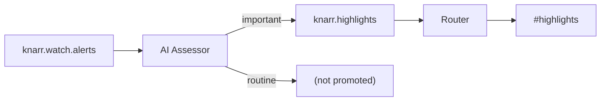
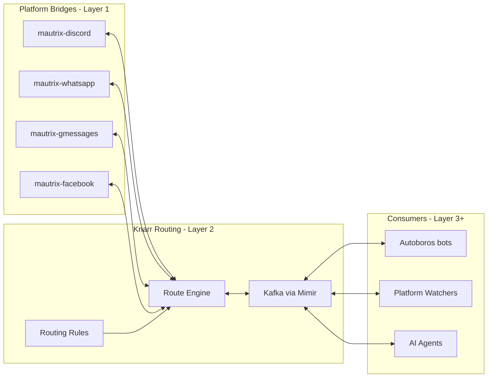
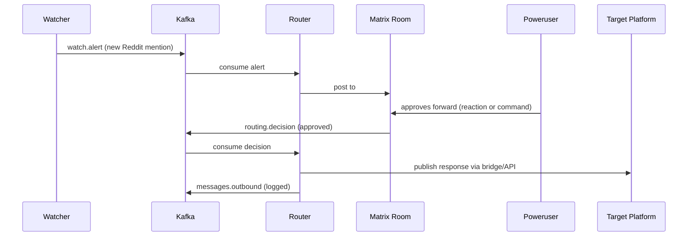
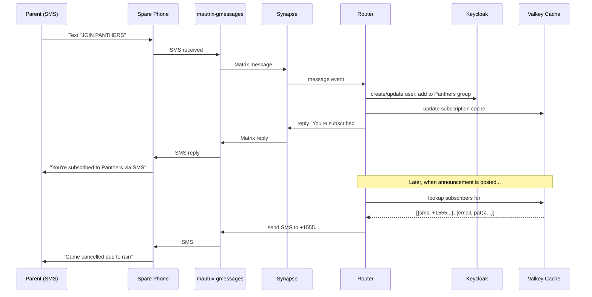
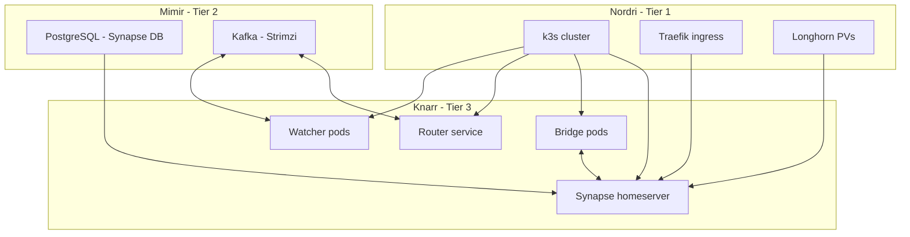

# Knarr Design Spec

**Date:** 2026-04-02
**Status:** Draft
**Component:** knarr (new)

---

## Overview

Knarr is the integration/bridging layer of the Yggdrasil ecosystem. It owns the
communication infrastructure: a self-hosted Matrix homeserver, bridge fleet, Kafka
message bus, and routing logic. It serves as a multi-community communication hub
for three audiences with very different platform mixes and engagement patterns.

**The metaphor:** Knarr is the merchant ship and its trade routes. It carries messages
between ports (platforms), knows the routes (routing rules), and keeps a manifest
(Kafka event log). Autoboros is the crew aboard — the agents who decide what cargo to
load, reshape goods for each market, and negotiate deals.

### Target Communities

| Community | Platforms in use | Urgency |
|-----------|-----------------|---------|
| **Terasology** (OSS game dev) | Discord, GitHub, Reddit, Twitter x2, YouTube, Steam forum, 2 blog sites, LinkedIn, Patreon, own forum (broken) | North star model; watching capability wanted immediately |
| **Sports league** (kids, parent coaches) | TeamSnap, scattered email, barely any communication | Spring season starts mid-April 2026 |
| **PTA** | WhatsApp, texting, email, Facebook | Demo-ready by end of school year (~June 2026) |

### Design Goals

1. **Spider in the web** — detect activity across platforms from a single Matrix dashboard
2. **Team visibility** — volunteer teams share awareness of what needs attention and what's been handled
3. **Meet people where they are** — parents use WhatsApp/SMS/Facebook; gamers use Discord; power users use Element
4. **Curated routing** — some messages flow automatically, some need human approval before fan-out
5. **Content adaptation** — write once, reshape per platform, review before publishing (Autoboros concern, Knarr provides the transport)

---

## System Boundaries

### Knarr Owns

| Concern | Description |
|---------|-------------|
| Matrix homeserver (Synapse) | Core communication hub |
| Bridge fleet (mautrix-*) | Platform connectivity |
| Kafka topics and event schemas | Internal message bus |
| Routing rules | What goes where, auto vs approval-gated |
| Room topology and access control | Spaces, rooms, permissions |
| Platform watchers | Monitoring external platforms for activity |

### Autoboros Owns

| Concern | Description |
|---------|-------------|
| Chatbot personalities and command handling | Body + brain components |
| Content adaptation | Reshaping posts per platform format |
| ChatOps workflows | PR creation, issue triage, etc. |
| AI agent integration | OpenClaw, LLM calls |

### Other Boundaries

- **Mimir (Tier 2):** Provides Kafka via Strimzi and PostgreSQL via Percona Crossplane compositions. Knarr declares what it needs; Mimir provisions.
- **Nidavellir (Tier 2):** Provides Keycloak as the ecosystem identity provider.
  Knarr uses Keycloak as the identity backbone for the subscription model (see
  Identity and Subscription Model section below).
- **Nordri (Tier 1):** Provides k3s cluster, Longhorn storage, Traefik ingress.
- **Nornir:** Governs permissions and approvals. Composes naturally with Keycloak
  identity — "is this person authorized to post announcements?" is a Nornir
  question answered using Keycloak identity.
- **GDD Git interface:** Future integration point. Autoboros chatbots could surface
  GDD-style Git commands for human preview/approval in Matrix rooms. Knarr provides
  transport; command formatting and approval UX is an Autoboros concern.

---

## Architecture Layers

### Layer 1: Nervous System (Matrix + Bridges)

Synapse homeserver with mautrix bridges, deployed via Helm into k3s.

**Bridge fleet:**

| Bridge | Community | Notes |
|--------|-----------|-------|
| mautrix-discord | Terasology | Immediate priority |
| mautrix-whatsapp | PTA, sports league | Spare phone as anchor device |
| mautrix-gmessages | Sports league, PTA | SMS via Google Messages on spare phone |
| mautrix-facebook | PTA | Meeting parents where they are |
| mautrix-slack | Future | If needed |

**Room hierarchy:**

Matrix Spaces can nest, allowing a Feeds sub-space per community for automated
platform monitoring, separate from human conversation rooms.

```text
#terasology/                       (public space)
  #general
  #dev
  #engine-room                     (private — content drafting, invite-only)
  #highlights                      (AI-curated important items — see below)
  #feeds/                          (sub-space — automated platform monitoring)
    #feed-reddit
    #feed-github
    #feed-steam
    #feed-twitter
    #feed-youtube
    #feed-discord                  (activity from non-bridged Discord channels)

#gdd/                              (space — workspace/tooling)
  #general
  #highlights
  #feeds/
    #feed-github                   (separate from Terasology's — different repos)

#pta/                              (private space, invite-only)
  #announcements
  #volunteers
  #events

#sports-league/                    (private space, invite-only)
  #announcements                   (bridged to WhatsApp group + SMS)
  #coaches
  #schedule                        (game times, cancellations)
```

### Cross-Room Linking

A single event may be relevant to multiple communities — e.g. a Bifrost PR that
touches both Terasology game code and GDD infrastructure patterns. Matrix doesn't
have native cross-room message linking, but the router can handle this:

**Link, don't mirror.** The router posts the full alert (with thread replies for
reactions/approval) in the primary room based on repo or first keyword match. In
secondary rooms, it posts a lightweight cross-reference with a Matrix permalink:

```text
#terasology/feeds/feed-github:
  📋 [PR] Bifrost module linking (#42)
    ├─ full details, thread replies, reacji workflows

#gdd/feeds/feed-github:
  🔗 Cross-ref from #terasology: Bifrost PR touches GDD patterns → [matrix.to link]
```

This preserves **single-point-of-action** (react/approve in one place) while
maintaining **cross-community awareness**. The cross-ref is informational — it
doesn't duplicate approval workflows or create processing ambiguity.

**Keyword routing rules** drive the matching:

```yaml
routing_rules:
  watchers:
    github:
      "MovingBlocks/*":
        primary: "#terasology/feeds/feed-github"
        keywords:
          gdd: "#gdd/feeds/feed-github"        # cross-ref if GDD mentioned
          bifrost: "#terasology/feeds/feed-github"  # stays primary
      "SiliconSaga/*":
        primary: "#gdd/feeds/feed-github"
        keywords:
          terasology: "#terasology/feeds/feed-github"
```

### AI Highlights Channel (Future)

When feed volume justifies it, an AI assessor consumes `knarr.watch.alerts` and
scores events for importance. Only significant items get promoted to a
`#highlights` room. This is another Kafka consumer — no new infrastructure.



**What the assessor looks for:**
- New contributor struggling (first-time PR with CI failures, confused issue report)
- Influencer or notable account mentioning the project
- Unusual activity spike (sudden burst of stars, downloads, or forum posts)
- Breakage signals (multiple issues filed about the same topic in short succession)
- Cross-project events (Bifrost PR linking Terasology and Destination Sol)

**Deferred** until feed volume makes manual monitoring impractical. The
architecture supports it whenever it becomes worthwhile — just add a consumer.

**User visibility model:** Power users (owner + a few volunteers) use Matrix directly
via Element. Everyone else stays on their native platform and never needs to know
Matrix exists. Power users are encouraged to "upgrade" to Element over time.

### Layer 2: Routing Layer (Kafka + Routing Logic)

A lightweight Knarr service that handles curated, rule-based message fan-out beyond
what transparent bridging provides. The router connects to Synapse as a Matrix bot
(client-server API), parallel to the bridges which use the appservice API. Bridges
handle transparent bidirectional chat; the router handles everything else — watching,
approval workflows, cross-posting orchestration.



**Kafka topics:**

| Topic | Purpose |
|-------|---------|
| `knarr.messages.inbound` | All messages arriving from any bridge |
| `knarr.messages.outbound` | Messages approved for publishing to platforms |
| `knarr.routing.pending` | Messages awaiting human approval before fan-out |
| `knarr.routing.decisions` | Approval/rejection events from power users |
| `knarr.watch.alerts` | Platform monitoring alerts (new mention, new thread) |
| `knarr.content.draft` | Content being shaped by Autoboros before publishing |
| `knarr.identity.changes` | Keycloak user/group change events for Valkey cache invalidation |

**Routing rule examples:**
- Messages in `#sports-league/announcements` → auto-forward to WhatsApp group + SMS list
- New Reddit mention of "Terasology" → post alert to `#terasology/social-watch`, await human decision
- Blog post draft approved in `#terasology/engine-room` → Autoboros adapts per platform → publish via `knarr.messages.outbound`

### Alert Batching and Threaded Digests

High-volume sources like GitHub can generate dozens of notifications in a short
window. Kafka stores every event individually (full granularity, replayable), but
the router controls how they're *displayed* in Matrix.

**Three display modes, configurable per room:**

| Mode | When to use | How it works |
|------|------------|--------------|
| Individual | Low-volume, each item may need action | One message per alert, reacji workflows work directly |
| Threaded digest | High-volume monitoring | Batch summary as top-level message; each item posted as a thread reply for per-item reactions |
| Flat digest | Thin channels (SMS, email) | Plain text summary, no threading |

**Threaded digest example** (in Matrix or bridged Discord):

```text
📋 GitHub — MovingBlocks/Terasology (last 30 min)
  4 new notifications
  ├─ [Issue] Fix rendering on ARM Macs (#5678)
  ├─ [PR] Update Gradle wrapper (#5679)
  ├─ [Issue] Crash on world gen (#5680)
  └─ [PR] Module loading refactor (#5681) — merged
```

The summary is the top-level message. Each item is a thread reply that power
users can expand and react to individually (approve forward, dismiss, etc.).
Casual readers just see the compact summary.

**Platform capabilities:**
- **Matrix + Discord:** Both support threads, both bridge threads via
  mautrix-discord. These two get the full threaded digest experience.
- **WhatsApp:** Has reply-to but not threads. Falls back to flat digest.
- **SMS/Email:** Flat digest only — a plain text summary of the batch.

**Routing rule integration:** The display mode is a per-room routing attribute:

```yaml
routing_rules:
  "#terasology/social-watch":
    display: threaded-digest
    batch_window_minutes: 30
  "#terasology/dev":
    display: individual
  "#sports-league/announcements":
    display: individual
```

The Kafka side is unaffected — watchers always publish individual events. Batching
is purely a router display concern, applied at the point of posting to Matrix.

### Layer 3: Agent Layer (Watchers + Integration Points)

**Platform watchers** — services that poll or subscribe to external platforms and
publish alerts to Kafka:

- Reddit watcher (API polling for subreddit/mention activity)
- Steam forum watcher (scraping or API)
- Twitter/X watcher (API access permitting)
- YouTube comment watcher
- GitHub notification aggregator

**Approval workflow:**



**Team visibility:** Because everything flows through Kafka, any volunteer in the
Matrix room can see what alerts are pending. When someone responds, the event is
logged and others can see it's handled. Kafka replay supports tooling for catch-up.

---

## Event Schema

### Phase 0/1 envelope (implemented)

The current producers/consumers use a reduced payload:

```json
{
  "event_id": "uuid",
  "timestamp": "2026-04-02T10:30:00Z",
  "source": {
    "platform": "reddit",
    "channel": "r/Terasology",
    "community": "terasology"
  },
  "content": {
    "type": "new_post",
    "body": "**Post title** by u/author",
    "url": "https://reddit.com/r/Terasology/..."
  }
}
```

This matches the `WatchAlert` dataclass in `src/watchers/schemas.py`.

### Target envelope (future)

When the routing layer and subscription model are implemented, the envelope
expands with `author` and `routing` fields:

```json
{
  "event_id": "uuid",
  "timestamp": "2026-04-02T10:30:00Z",
  "source": {
    "platform": "discord",
    "channel": "terasology-general",
    "community": "terasology"
  },
  "author": {
    "platform_id": "discord:12345",
    "display_name": "contributor42"
  },
  "content": {
    "type": "text",
    "body": "Has anyone tried the new module system?"
  },
  "routing": {
    "status": "auto",
    "targets": ["matrix:#terasology/general"],
    "requires_approval": false
  }
}
```

For approval workflows, `routing.status` cycles: `pending` → `approved`/`rejected`
→ `published`, with each transition as a separate event on `knarr.routing.decisions`.

All services should include a `schema_version` field when the target envelope
is introduced, to support backward-compatible rollout.

---

## Identity and Subscription Model

The routing layer (Layer 2) currently thinks in terms of rooms and platforms: "messages
in this room go to that WhatsApp group." The identity model adds a user dimension:
"this person wants notifications from this room via SMS."

This is critical for the sports league and PTA use cases where each parent has a
preferred channel and non-technical users need a frictionless way to opt in.

### User Identity

A Knarr identity ties together a person's accounts across platforms:

```yaml
user:
  display_name: "Coach Mike"
  community: sports-league
  accounts:
    - platform: matrix
      id: "@mike:knarr.local"      # only if power user
    - platform: whatsapp
      id: "+15550123"
    - platform: sms
      id: "+15550123"              # can overlap with whatsapp number
    - platform: email
      id: "mike@example.com"
  subscriptions:
    - room: "#panthers/announcements"
      channel: sms
    - room: "#panthers/coaches"
      channel: whatsapp
    - room: "#league/schedule"
      channel: email
      mode: digest                 # daily digest instead of per-message
```

### Keycloak as Identity Backbone

Rather than building a standalone user database, Knarr uses Keycloak (already
provided by Nidavellir) as the identity backbone:

- **Each Knarr user is a Keycloak user** — created automatically when someone
  opts in via SMS/email, or manually by a power user. Non-technical users never
  see Keycloak or a login page.
- **Platform accounts as user attributes** — WhatsApp number, Discord ID, email,
  Matrix ID stored as Keycloak custom attributes on the user profile.
- **Keycloak groups as teams** — "Panthers parents" is a Keycloak group.
  Membership drives which rooms/subscriptions are available.
- **SSO for future web UI** — any Knarr admin interface is just an OIDC client
  against Keycloak. No separate auth system.
- **Nornir integration** — Nornir can answer authorization questions ("can this
  person post league-wide announcements?") using the same Keycloak identity.

**Performance:** The router needs fast subscription lookups on every message
fan-out. Hitting the Keycloak admin API per message would be too slow. The router
uses a Valkey cache (provisioned via Mimir's Crossplane composition) for
subscription lookups — a hash per room mapping to subscriber entries. Keycloak's
event listener SPI pushes user/group changes to a Kafka topic
(`knarr.identity.changes`); a small sync service consumes those events and
invalidates the Valkey cache for near-real-time updates.

**Frictionless principle:** The self-service SMS/email flow creates a Keycloak user
behind the scenes. A parent texting "JOIN PANTHERS" should never encounter a login
page, password prompt, or any hint that Keycloak exists. Power users and admins get
the full Keycloak experience (SSO, user management, group assignment).

### How Routing Changes

Current model (room-level):

```text
#panthers/announcements → WhatsApp group (all members see everything)
```

Extended model (room + user subscriptions):

```text
#panthers/announcements →
  WhatsApp group (for whatsapp subscribers — transparent bridge)
  SMS to +1-555-0123 (Coach Mike, subscribed via SMS)
  SMS to +1-555-0456 (Parent Jane, subscribed via SMS)
  email to pat@example.com (Parent Pat, subscribed via email)
```

The WhatsApp group bridge is still a transparent mautrix bridge. The SMS and email
deliveries are individual fan-outs handled by the router based on subscription data.

### Self-Service Opt-In/Opt-Out

Non-technical users never need to know Matrix exists. They interact with Knarr
through the channel they already use:

**SMS (via spare phone / mautrix-gmessages):**

```text
→ Text "JOIN PANTHERS" to the Knarr number
← "You're subscribed to Panthers announcements via SMS. Text STOP to unsubscribe."

→ Text "STOP"
← "You've been unsubscribed from all notifications."

→ Text "HELP"
← "Available teams: PANTHERS, EAGLES, TIGERS. Text JOIN <team> to subscribe."
```

**Email:**

```text
→ Send any email to panthers+join@knarr.example.com
← Auto-reply: "You're subscribed to Panthers announcements via email."

→ Send to panthers+stop@knarr.example.com
← Auto-reply: "You've been unsubscribed."
```

Email opt-in/out requires a mail receiver — either a simple SMTP listener in the
cluster or an inbound webhook from a service like Mailgun/Sendgrid.

**WhatsApp:**
Users who join the bridged WhatsApp group are implicitly subscribed. No extra
opt-in needed — the bridge handles it. They can leave the group to unsubscribe.

### Power User Admin

Power users can manage subscriptions on behalf of others via Matrix bot commands
in an admin room:

```text
!knarr subscribe +15550123 #panthers/announcements sms
!knarr subscribe mike@example.com #league/schedule email-digest
!knarr list-subscribers #panthers/announcements
!knarr unsubscribe +15550123 all
```

Or eventually a small web UI. The bot command gets there first.

### Subscription Flow



---

## Bridge Limitations

Bridges between rich and thin platforms involve inherent trade-offs. The design
principle: accept graceful degradation rather than building complex translation
layers.

### Emoji Reactions

| Bridge | Support | Notes |
|--------|---------|-------|
| Matrix ↔ Discord | Good | mautrix-discord supports bidirectional reactions. Custom emoji may not translate. |
| Matrix ↔ WhatsApp | Basic | mautrix-whatsapp supports standard emoji reactions. |
| Matrix ↔ SMS | None | Reactions appear as text: "(Mike reacted with 👍)" |
| Matrix ↔ Email | None | Same text degradation as SMS. |

Rich-to-rich bridging (Discord ↔ Matrix ↔ WhatsApp) works well. Thin channels
(SMS, email) get text descriptions. Don't try to build a universal reaction system.

### Threads

| Bridge | Support | Notes |
|--------|---------|-------|
| Matrix ↔ Discord | Reasonable | Discord threads map to Matrix threads (MSC3440). Workable but not perfect. |
| Matrix ↔ WhatsApp | Reply-to only | WhatsApp has reply-to-message but not threads. Threads collapse to replies. |
| Matrix ↔ SMS/Email | None | Threads collapse into the flat message stream. |

Discord forum channels are a special case — they're "a room full of threads." The
bridge maps each forum post to a Matrix thread, which is usable but lossy. For
communities using forum channels heavily, a dedicated Matrix room per forum post
may work better than bridging the entire forum channel.

### Design Guidance

- **Don't normalize up.** Don't try to give SMS users a thread experience. They
  signed up for a simpler channel and that's fine.
- **Preserve richness where it exists.** Discord ↔ Matrix reactions and threads
  work — let them work. Don't strip features to match the lowest common denominator.
- **Inform users of limitations.** A power user configuring a bridge should know
  that SMS subscribers won't see threads or reactions. Surface this in the admin
  tooling.

---

## Tech Stack

| Component | Technology | Rationale |
|-----------|-----------|-----------|
| Homeserver | Synapse | Most mature, best bridge compatibility, Python |
| Bridges | mautrix suite | Active development, Python, consistent API |
| Router | Python (FastAPI or similar) | Lightweight, same language as bridges and Autoboros |
| Watchers | Python | Same ecosystem; each watcher is a small service |
| Message bus | Kafka via Mimir | Already in stack, durable log for audit and replay |
| Database | PostgreSQL via Mimir | Synapse requires it, already vended by Crossplane |
| Client | Element | Standard Matrix client, mobile + desktop |

---

## Deployment Architecture

Knarr is a Tier 3 application deployed via ArgoCD.



### Helm Chart Structure

```text
knarr/
  Chart.yaml
  values.yaml               # Defaults
  values-local.yaml          # Local k3s overrides
  values-gke.yaml            # GKE production overrides
  templates/
    synapse/
      deployment.yaml
      service.yaml
      configmap.yaml         # homeserver.yaml generation
    bridges/
      discord.yaml
      whatsapp.yaml
      gmessages.yaml
      facebook.yaml
    router/
      deployment.yaml
      service.yaml
      configmap.yaml         # routing rules
    watchers/
      reddit.yaml
      steam.yaml
      twitter.yaml
      youtube.yaml
      github.yaml
  config/
    homeserver/              # Synapse config templates
    bridges/                 # Bridge registration files
    routing/                 # Routing rule definitions
  src/
    router/                  # Knarr router service source
    watchers/                # Watcher service source
  tests/
    features/                # BDD specs for routing behavior
  docs/
    architecture.md
    bridges.md
    routing-rules.md
```

### Spare Phone

The spare phone serves as the persistent anchor for mautrix-whatsapp (WhatsApp Web
session) and mautrix-gmessages (SMS via Google Messages). It must stay powered on
and connected. For local testing it sits on the same network as the k3s node. When
the homeserver moves to GKE, the phone needs to remain reachable — either colocated
with a bridge pod on a local machine, or via a relay. The phone is 100% dedicated
to Knarr.

---

## Phasing

| Phase | Scope | Timeline | Goal |
|-------|-------|----------|------|
| 0 | Bare Synapse + Postgres on M1 Mac k3s | Week 1 | "I can chat with myself across devices via my own server" |
| 1 | mautrix-discord + Terasology watching | Week 2 | "I can see Terasology activity across platforms from one place" |
| 2 | mautrix-whatsapp + mautrix-gmessages for sports league | Weeks 3-4 | "Coaches and parents can communicate, I see everything in Element" |
| 3 | Kafka topics + routing engine + approval workflows | Weeks 5-8 | "The volunteer team has shared awareness of what needs attention" |
| 4 | Cross-posting + content adaptation (Autoboros integration) | Weeks 8-12 | "I write a post once and publish everywhere with review" |
| 5 | PTA bridges + demo | Months 2-3 | "Show a working communication hub that meets parents where they are" |

### Phase Details

**Phase 0 — Bare homeserver:**
Deploy Synapse + Postgres on M1 Mac k3s. Create room hierarchy (spaces for each
community). Connect with Element from phone and desktop. Federation disabled
(private homeserver). Validate basic operation.

**Phase 1 — Discord bridge + Terasology watching:**
Deploy mautrix-discord, bridge key Terasology channels. Deploy Kafka topics via
Mimir. Deploy first watchers (Reddit, GitHub notifications). Stand up
`#terasology/social-watch` room with alerts flowing in.

**Phase 2 — Sports league bridge:**
Deploy mautrix-whatsapp, link spare phone. Bridge `#sports-league/announcements`
to WhatsApp group. Deploy mautrix-gmessages for SMS. Test with coaches first.

**Phase 3 — Routing engine + approval workflows:**
Build the Knarr router service. Implement routing rules (auto-forward vs
pending-approval). Approval UX in Matrix rooms (reactions or bot commands). Team
visibility — volunteers see what's been handled.

**Phase 4 — Cross-posting + content adaptation:**
Integration point for Autoboros content adaptation. Blog post → multi-platform
publish workflow. Platform-specific formatting.

**Phase 5 — PTA demo:**
Apply bridge infrastructure (WhatsApp, SMS, Facebook). PTA-specific room hierarchy
and routing rules. Demo to PTA leadership.

---

## Autoboros Migration Path

The stem component in Autoboros becomes legacy. Migration steps:

1. Knarr deploys with Kafka topics active
2. Autoboros adds a Kafka consumer/producer (replacing NATS client code in stem)
3. Autoboros body/brain connect to `knarr.messages.inbound` to receive chat events
4. Autoboros publishes responses to `knarr.messages.outbound`
5. Stem's NATS code is archived or removed

After migration, Autoboros no longer connects directly to Discord. It connects to
Kafka, and Knarr handles all platform I/O.

---

## Federation and Multi-Instance Growth

Knarr is designed as a Demicracy community component. A single instance serves
one community (or several small ones under one admin), but over time neighboring
communities may want their own instances — with their own admins, data, and
policies — while still sharing some rooms.

### Growth Stages

**Stage 1 — Single instance.** One Knarr/Synapse deployment hosts everything.
Users from other communities join as guests or registered users on the same
homeserver. Simple, no federation needed.

**Stage 2 — Second instance.** Another community deploys their own Knarr (same
Helm chart, their own infrastructure). Federation is enabled between the two
Synapse homeservers. Users on either server can join rooms on the other.

```text
knarr.town-a.org                     knarr.town-b.org
├─ #town-a-pta/                      ├─ #town-b-pta/
│   (local rooms)                    │   (local rooms)
└─ #regional-league/  ←─federation─→ └─ #regional-league/
    (shared, replicated)                 (shared, replicated)
```

**Stage 3 — Shared spaces, separate admin.** A cross-community space (e.g. a
sports league spanning two towns) is federated. Each server holds a replica of
the shared rooms. Each admin controls their own users and local rooms. If one
server goes down, the other continues operating — messages queue and sync on
reconnect.

**Stage 4 — Community kit.** The full Knarr deployment — Helm chart, bridge
configs, routing rules, subscription model — becomes a Demicracy "community kit"
template. A new neighborhood deploys it, customizes their rooms and bridges, and
federates with neighbors as desired.

### What Federates and What Stays Local

Matrix federation handles chat replication between homeservers natively. The
question is what happens to the Knarr-specific layers (Kafka, routing,
subscriptions, watchers) when multiple instances exist.

Several options exist, and the right choice depends on how the communities
actually grow:

**Option A — Federation at Matrix only, everything else local.** Each Knarr
instance runs its own Kafka, watchers, router, Keycloak, and Valkey. Instances
connect only through Matrix federation for shared rooms. Each town's router
handles their own subscribers (local parents get SMS/email from their local
Knarr). Simplest, most robust, each deployment is self-contained.

**Option B — Shared watchers, separate routing.** For a federated sports league,
the social media watcher runs on one instance and posts to the federated room.
Both towns' routers see the Matrix message and handle their own local subscribers.
No cross-instance Kafka needed — federation delivers the message to both
homeservers.

**Option C — Cross-instance event bus.** Kafka topics are mirrored between
instances (via MirrorMaker or similar). Both routers see all events. More
complex, potentially useful if cross-community workflows (like shared approval
chains) are needed.

**Option D — Hub-and-spoke.** One instance acts as the "league hub" for shared
watchers and routing. Spoke instances handle local rooms and subscribers only.
The hub federates with all spokes via Matrix. Simpler than full mesh, but
introduces a central point.

These options are not mutually exclusive — a deployment could start with Option A
and adopt elements of B or D as the federation grows. The design intentionally
leaves this open; the right answer depends on real usage patterns that don't exist
yet.

### Identity Across Instances

Keycloak supports cross-realm trust and identity brokering. A user registered on
Town A's Keycloak could authenticate to Town B's Knarr web UI via OIDC federation,
without creating a separate account. This parallels how Matrix federation handles
user identity — `@coach:town-a.org` is recognized on `town-b.org` without
re-registration.

The subscription model works per-instance: Coach Mike's SMS subscription is
managed by his local Knarr instance, even if the room he's subscribed to is
federated from another server.

---

## Future Explorations

### Web-Searchable Chat Archive ("Scribe")

Bring back IRC-style public chat logging for the modern multi-platform world.
A Kafka consumer ("scribe") reads `knarr.messages.inbound`, writes messages to
a static site (Hugo/Jekyll/plain HTML) organized by room and date, and deploys
to GitHub Pages or in-cluster. Because everything flows through Kafka, this
archives all bridged platforms (Discord, Matrix, future bridges) — not just
Matrix-native messages. Kafka replay enables regenerating the archive from
history. Public rooms only; routing rules can control what gets archived.

### Blog Comments via Cactus Comments

Cactus Comments uses Matrix rooms as a commenting backend for static sites.
Each blog post gets a dedicated Matrix room. Comments posted on the blog appear
in Matrix (and vice versa — moderatable from Element). The JS widget renders
client-side, so comments are not search-engine indexable by default. The scribe
archiver above could solve this: blog comment rooms flow through Kafka like any
other room, and the scribe produces a static indexed copy. This gives interactive
commenting + permanent searchable record.

Relevant for the Terasology blog sites and the personal blog (Cervator.github.io).

---

## Decisions

| Decision | Choice | Rationale |
|----------|--------|-----------|
| Message bus | Kafka (not NATS) | Already in stack via Mimir; NATS had cross-platform reliability issues; Kafka's durable log enables team visibility and replay |
| Homeserver | Synapse (not Dendrite/Conduit) | Most mature, best bridge compatibility |
| Approach | Layered Hub (not Bridge-First Monolith or Federation-First) | Clean separation of concerns; can deploy Layer 1 immediately and build Layers 2-3 iteratively; can split to federation later if needed |
| Phasing order | Terasology first (not sports league) | More engaged testers, watching capability wanted immediately |
| User visibility | Matrix hidden from end users | Power users use Element directly; everyone else stays on native platforms |
