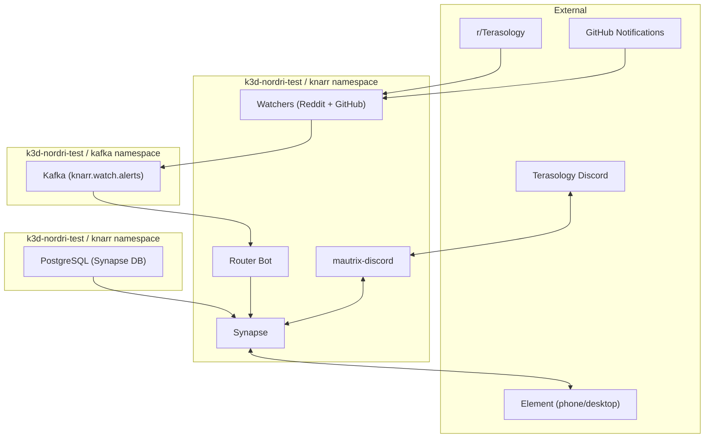

# Knarr Phase 0 + Phase 1 Implementation Plan

> **For agentic workers:** REQUIRED SUB-SKILL: Use superpowers:subagent-driven-development (recommended) or superpowers:executing-plans to implement this plan task-by-task. Steps use checkbox (`- [ ]`) syntax for tracking.

**Goal:** Deploy a self-hosted Matrix homeserver (Synapse) on the local k3d cluster with a Discord bridge for Terasology, Kafka event bus, and initial platform watchers — establishing Knarr as a working communication hub.

**Architecture:** Synapse runs as a Kubernetes deployment backed by PostgreSQL via Mimir's Crossplane composition. mautrix-discord bridges Terasology Discord channels into Matrix rooms. A Kafka cluster (also via Mimir) provides the event bus for platform watchers that monitor Reddit and GitHub. The Knarr router bot connects to Synapse and posts watcher alerts to a `#social-watch` Matrix room.

**Tech Stack:** Synapse (Matrix homeserver), mautrix-discord (bridge), Kafka via Strimzi/Mimir, PostgreSQL via Percona/Mimir, Python (router + watchers), Helm, k3d (OrbStack on M1 Mac), ArgoCD, Traefik.

**Target cluster:** `k3d-nordri-test` (M1 Mac, OrbStack, K3s v1.31.5, Traefik on LoadBalancer, Longhorn absent — uses `local-path` default StorageClass)

**Prerequisites:**
- `k3d-nordri-test` cluster running (confirmed: 3 nodes, operators ready)
- Crossplane compositions available: `xpostgresql-percona`, `xkafkacluster-strimzi`
- Strimzi operator running in `kafka` namespace
- Percona PG operator running in `percona` namespace
- A Discord bot token for the Terasology server (user must create this)
- Element app installed on phone and/or desktop

---

## File Map

All files are created in a new `knarr` Git repository, to be cloned into `components/knarr/`.

```
knarr/
├── k8s/
│   ├── namespace.yaml                    # knarr namespace
│   ├── postgres-claim.yaml               # Crossplane PostgreSQLInstance for Synapse
│   ├── kafka-claim.yaml                  # Crossplane KafkaCluster for event bus
│   ├── kafka-topics.yaml                 # Strimzi KafkaTopic resources
│   ├── synapse/
│   │   ├── deployment.yaml               # Synapse homeserver pod
│   │   ├── service.yaml                  # ClusterIP service
│   │   ├── configmap.yaml                # homeserver.yaml config
│   │   └── ingressroute.yaml             # Traefik IngressRoute
│   └── bridges/
│       └── discord/
│           ├── deployment.yaml           # mautrix-discord pod
│           ├── configmap.yaml            # bridge config
│           └── registration-secret.yaml  # appservice registration
├── src/
│   ├── router/
│   │   ├── __init__.py
│   │   ├── main.py                       # Knarr router bot (Matrix + Kafka)
│   │   ├── kafka_consumer.py             # Consume watcher alerts, post to Matrix
│   │   └── Dockerfile
│   └── watchers/
│       ├── __init__.py
│       ├── reddit_watcher.py             # Poll Reddit API, publish to Kafka
│       ├── github_watcher.py             # Poll GitHub notifications, publish to Kafka
│       ├── schemas.py                    # Shared Kafka event envelope schema
│       └── Dockerfile
├── tests/
│   ├── test_schemas.py                   # Event envelope validation
│   ├── test_reddit_watcher.py            # Reddit watcher unit tests
│   ├── test_github_watcher.py            # GitHub watcher unit tests
│   └── test_router.py                    # Router bot unit tests
├── pyproject.toml                        # Python project config
├── requirements.txt                      # Python dependencies
└── README.md                             # Component overview
```

---

## Task 1: Create the Knarr Repository and Namespace

**Files:**
- Create: `knarr/k8s/namespace.yaml`
- Create: `knarr/README.md`
- Create: `knarr/pyproject.toml`
- Create: `knarr/requirements.txt`

- [ ] **Step 1: Create the knarr repo on GitHub**

Create a new repository `knarr` under the SiliconSaga org (or your personal GitHub). Initialize with a README.

```bash
gh repo create SiliconSaga/knarr --public --description "Integration/bridging layer — Matrix homeserver, bridges, and message routing" --clone
```

If using personal GitHub instead, adjust the org name.

- [ ] **Step 2: Create the namespace manifest**

Create `k8s/namespace.yaml`:

```yaml
apiVersion: v1
kind: Namespace
metadata:
  name: knarr
  labels:
    app.kubernetes.io/part-of: knarr
```

- [ ] **Step 3: Create pyproject.toml**

Create `pyproject.toml`:

```toml
[project]
name = "knarr"
version = "0.1.0"
description = "Knarr — Matrix integration hub, bridges, and message routing"
requires-python = ">=3.11"
dependencies = [
    "matrix-nio>=0.24.0",
    "confluent-kafka>=2.6.0",
    "pydantic>=2.0",
    "httpx>=0.27.0",
]

[project.optional-dependencies]
dev = [
    "pytest>=8.0",
    "pytest-asyncio>=0.24.0",
]

[tool.pytest.ini_options]
asyncio_mode = "auto"
testpaths = ["tests"]
```

- [ ] **Step 4: Create requirements.txt**

Create `requirements.txt`:

```
matrix-nio>=0.24.0
confluent-kafka>=2.6.0
pydantic>=2.0
httpx>=0.27.0
```

- [ ] **Step 5: Create README.md**

Create `README.md`:

```markdown
# Knarr

Integration/bridging layer for the Yggdrasil ecosystem. Self-hosted Matrix
homeserver with bridges, Kafka event bus, and platform watchers.

See [knarr-design.md](../yggdrasil/docs/plans/2026-04-02-knarr-design.md) for
the full design spec.

## Components

- **Synapse** — Matrix homeserver
- **mautrix-discord** — Discord bridge
- **Router** — Kafka-to-Matrix alert routing bot
- **Watchers** — Reddit, GitHub platform monitors
```

- [ ] **Step 6: Apply the namespace**

```bash
kubectl --context k3d-nordri-test apply -f k8s/namespace.yaml
```

Expected: `namespace/knarr created`

- [ ] **Step 7: Commit**

Write `.commits/01-init.md`:

```markdown
---
add:
  - k8s/namespace.yaml
  - README.md
  - pyproject.toml
  - requirements.txt
---

feat: initialize knarr repository with namespace and project config
```

```bash
bash scripts/ws commit knarr .commits/01-init.md
```

---

## Task 2: Provision PostgreSQL for Synapse

**Files:**
- Create: `knarr/k8s/postgres-claim.yaml`

- [ ] **Step 1: Create the Crossplane PostgreSQL claim**

Create `k8s/postgres-claim.yaml`:

```yaml
apiVersion: database.example.org/v1alpha1
kind: PostgreSQLInstance
metadata:
  name: synapse-db
  namespace: knarr
spec:
  parameters:
    storageSize: 2Gi
    version: "15"
    replicas: 1
    databaseName: synapse
  compositionSelector:
    matchLabels:
      provider: percona
      service: postgresql
```

- [ ] **Step 2: Apply the claim**

```bash
kubectl --context k3d-nordri-test apply -f k8s/postgres-claim.yaml
```

Expected: `postgresqlinstance.database.example.org/synapse-db created`

- [ ] **Step 3: Wait for the database to become ready**

```bash
kubectl --context k3d-nordri-test get postgresqlinstance synapse-db -n knarr -w
```

Wait until `READY` shows `True`. This may take 2-3 minutes as Percona creates the cluster. While waiting, verify the pods:

```bash
kubectl --context k3d-nordri-test get pods -n knarr
```

Expected: pods like `synapse-db-instance1-xxxx-0` appearing and reaching `Running`.

- [ ] **Step 4: Verify the connection secret**

```bash
kubectl --context k3d-nordri-test get secrets -n knarr | grep synapse-db
```

Look for a secret containing connection credentials. Note the secret name — it will be referenced in the Synapse config.

```bash
kubectl --context k3d-nordri-test get secret synapse-db-pguser-synapse-db -n knarr -o jsonpath='{.data}' | python3 -c "import sys,json,base64; d=json.load(sys.stdin); [print(f'{k}: {base64.b64decode(v).decode()}') for k,v in d.items()]"
```

Record the host, port, user, password, and dbname values.

- [ ] **Step 5: Commit**

Write `.commits/02-postgres.md`:

```markdown
---
add:
  - k8s/postgres-claim.yaml
---

feat: provision PostgreSQL for Synapse via Mimir Crossplane composition
```

```bash
bash scripts/ws commit knarr .commits/02-postgres.md
```

---

## Task 3: Deploy Synapse Homeserver

**Files:**
- Create: `knarr/k8s/synapse/configmap.yaml`
- Create: `knarr/k8s/synapse/deployment.yaml`
- Create: `knarr/k8s/synapse/service.yaml`
- Create: `knarr/k8s/synapse/ingressroute.yaml`

- [ ] **Step 1: Generate a Synapse signing key and registration shared secret**

```bash
# Generate a signing key (Synapse format)
python3 -c "
import base64, os
key_bytes = os.urandom(32)
key_id = 'a_' + base64.b64encode(os.urandom(3)).decode().rstrip('=')
key_b64 = base64.b64encode(key_bytes).decode()
print(f'ed25519 {key_id} {key_b64}')
" > /tmp/synapse-signing-key.txt
cat /tmp/synapse-signing-key.txt

# Generate a registration shared secret
python3 -c "import secrets; print(secrets.token_urlsafe(32))"
```

Record both values. The signing key goes in a Secret; the shared secret goes in homeserver.yaml.

- [ ] **Step 2: Create the signing key secret**

```bash
kubectl --context k3d-nordri-test create secret generic synapse-signing-key \
  -n knarr \
  --from-file=signing.key=/tmp/synapse-signing-key.txt
rm /tmp/synapse-signing-key.txt
```

Expected: `secret/synapse-signing-key created`

- [ ] **Step 3: Create the Synapse configmap**

Create `k8s/synapse/configmap.yaml`. Replace `REGISTRATION_SHARED_SECRET` with the value from Step 1. Replace `DB_HOST`, `DB_USER`, `DB_PASSWORD` with values from Task 2 Step 4.

```yaml
apiVersion: v1
kind: ConfigMap
metadata:
  name: synapse-config
  namespace: knarr
data:
  homeserver.yaml: |
    server_name: "knarr.local"
    pid_file: "/data/homeserver.pid"
    listeners:
      - port: 8008
        tls: false
        type: http
        x_forwarded: true
        resources:
          - names: [client, federation]
            compress: false
    database:
      name: psycopg2
      args:
        user: "DB_USER"
        password: "DB_PASSWORD"
        database: "synapse"
        host: "DB_HOST"
        port: "5432"
        cp_min: 2
        cp_max: 5
    signing_key_path: "/keys/signing.key"
    suppress_key_server_warning: true
    enable_registration: false
    registration_shared_secret: "REGISTRATION_SHARED_SECRET"
    federation_domain_whitelist: []
    allow_public_rooms_over_federation: false
    media_store_path: "/data/media_store"
    log_config: "/config/log.yaml"
    trusted_key_servers: []
    app_service_config_files: []

  log.yaml: |
    version: 1
    formatters:
      precise:
        format: '%(asctime)s - %(name)s - %(lineno)d - %(levelname)s - %(message)s'
    handlers:
      console:
        class: logging.StreamHandler
        formatter: precise
    root:
      level: INFO
      handlers: [console]
```

Note: `federation_domain_whitelist: []` and empty `trusted_key_servers` effectively disable federation — this is a private homeserver.

- [ ] **Step 4: Create the Synapse deployment**

Create `k8s/synapse/deployment.yaml`:

```yaml
apiVersion: apps/v1
kind: Deployment
metadata:
  name: synapse
  namespace: knarr
  labels:
    app: synapse
spec:
  replicas: 1
  selector:
    matchLabels:
      app: synapse
  template:
    metadata:
      labels:
        app: synapse
    spec:
      containers:
        - name: synapse
          image: matrixdotorg/synapse:v1.122.0
          ports:
            - containerPort: 8008
          volumeMounts:
            - name: config
              mountPath: /config
            - name: signing-key
              mountPath: /keys
              readOnly: true
            - name: data
              mountPath: /data
          env:
            - name: SYNAPSE_CONFIG_DIR
              value: /config
            - name: SYNAPSE_CONFIG_PATH
              value: /config/homeserver.yaml
          resources:
            requests:
              cpu: 100m
              memory: 256Mi
            limits:
              memory: 512Mi
          readinessProbe:
            httpGet:
              path: /health
              port: 8008
            initialDelaySeconds: 10
            periodSeconds: 10
          livenessProbe:
            httpGet:
              path: /health
              port: 8008
            initialDelaySeconds: 30
            periodSeconds: 30
      volumes:
        - name: config
          configMap:
            name: synapse-config
        - name: signing-key
          secret:
            secretName: synapse-signing-key
        - name: data
          emptyDir: {}
```

Note: `data` uses `emptyDir` for now. Media uploads will be lost on pod restart, which is acceptable for initial testing. A PVC can be added later.

- [ ] **Step 5: Create the Synapse service**

Create `k8s/synapse/service.yaml`:

```yaml
apiVersion: v1
kind: Service
metadata:
  name: synapse
  namespace: knarr
spec:
  selector:
    app: synapse
  ports:
    - port: 8008
      targetPort: 8008
      protocol: TCP
  type: ClusterIP
```

- [ ] **Step 6: Create the Traefik IngressRoute**

Create `k8s/synapse/ingressroute.yaml`:

```yaml
apiVersion: traefik.io/v1alpha1
kind: IngressRoute
metadata:
  name: synapse
  namespace: knarr
spec:
  entryPoints:
    - web
  routes:
    - match: Host(`matrix.knarr.local`)
      kind: Rule
      services:
        - name: synapse
          port: 8008
```

- [ ] **Step 7: Add a local DNS entry**

Add to `/etc/hosts` (requires sudo):

```bash
echo "127.0.0.1 matrix.knarr.local" | sudo tee -a /etc/hosts
```

If using OrbStack, the k3d LoadBalancer IP may differ. Check with:

```bash
kubectl --context k3d-nordri-test get svc -n kube-system traefik -o jsonpath='{.status.loadBalancer.ingress[0].ip}'
```

Use that IP instead of `127.0.0.1` if different.

- [ ] **Step 8: Deploy Synapse**

```bash
kubectl --context k3d-nordri-test apply -f k8s/synapse/
```

Expected: configmap, deployment, service, and ingressroute created.

- [ ] **Step 9: Verify Synapse is running**

```bash
kubectl --context k3d-nordri-test get pods -n knarr -l app=synapse
```

Wait for `Running` and `1/1 Ready`. If the pod crashes, check logs:

```bash
kubectl --context k3d-nordri-test logs -n knarr -l app=synapse --tail=50
```

Then test the health endpoint:

```bash
curl -s http://matrix.knarr.local/health
```

Expected: `OK`

- [ ] **Step 10: Create an admin user**

```bash
kubectl --context k3d-nordri-test exec -n knarr deploy/synapse -- \
  register_new_matrix_user -c /config/homeserver.yaml \
  -u admin -p <choose-a-password> -a \
  http://localhost:8008
```

Replace `<choose-a-password>` with an actual password. The `-a` flag makes this an admin account.

- [ ] **Step 11: Test login from Element**

Open Element (desktop or phone), click "Sign in", use custom homeserver: `http://matrix.knarr.local`. Log in with the admin user created above. If on phone, ensure the phone can reach the k3d cluster (same network, or use the OrbStack IP).

- [ ] **Step 12: Create the room hierarchy**

From Element as admin, create:
- Space: `Terasology` (public)
  - Room: `#general` (in Terasology space)
  - Room: `#dev` (in Terasology space)
  - Room: `#social-watch` (in Terasology space)
  - Room: `#engine-room` (in Terasology space, invite-only)
- Space: `Sports League` (private, invite-only)
  - Room: `#announcements`
  - Room: `#coaches`
  - Room: `#schedule`
- Space: `PTA` (private, invite-only)
  - Room: `#announcements`
  - Room: `#volunteers`
  - Room: `#events`

This can be done via the Element UI. The rooms will be populated with bridges later.

- [ ] **Step 13: Commit**

Write `.commits/03-synapse.md`:

```markdown
---
add:
  - k8s/synapse/configmap.yaml
  - k8s/synapse/deployment.yaml
  - k8s/synapse/service.yaml
  - k8s/synapse/ingressroute.yaml
---

feat: deploy Synapse homeserver with Traefik ingress

Private Matrix homeserver on knarr.local, federation disabled,
backed by Percona PostgreSQL via Crossplane.
```

```bash
bash scripts/ws commit knarr .commits/03-synapse.md
```

---

## Task 4: Provision Kafka for the Event Bus

**Files:**
- Create: `knarr/k8s/kafka-claim.yaml`
- Create: `knarr/k8s/kafka-topics.yaml`

- [ ] **Step 1: Create the Kafka cluster claim**

Create `k8s/kafka-claim.yaml`:

```yaml
apiVersion: mimir.siliconsaga.org/v1alpha1
kind: KafkaCluster
metadata:
  name: knarr-kafka
  namespace: knarr
spec:
  parameters:
    replicas: 1
    storageSize: "2Gi"
    version: "4.0.0"
```

Note: `replicas: 1` for local testing. Production (GKE) would use 3.

- [ ] **Step 2: Apply the Kafka claim**

```bash
kubectl --context k3d-nordri-test apply -f k8s/kafka-claim.yaml
```

Expected: `kafkacluster.mimir.siliconsaga.org/knarr-kafka created`

- [ ] **Step 3: Wait for Kafka to become ready**

```bash
kubectl --context k3d-nordri-test get kafkacluster knarr-kafka -n knarr -w
```

This takes longer than Postgres — Strimzi needs to create the KRaft controller and broker. Watch pods:

```bash
kubectl --context k3d-nordri-test get pods -n kafka -w
```

Wait until the kafka pods are `Running` and `Ready`.

- [ ] **Step 4: Verify the bootstrap service**

```bash
kubectl --context k3d-nordri-test get svc -n kafka | grep knarr
```

Look for a service like `knarr-kafka-kafka-bootstrap`. Record the full service name — it will be used as the Kafka bootstrap server: `<service-name>.kafka.svc.cluster.local:9092`

- [ ] **Step 5: Create the Kafka topics**

Create `k8s/kafka-topics.yaml`:

```yaml
apiVersion: kafka.strimzi.io/v1beta2
kind: KafkaTopic
metadata:
  name: knarr.messages.inbound
  namespace: kafka
  labels:
    strimzi.io/cluster: knarr-kafka-kafka
spec:
  partitions: 1
  replicas: 1
  config:
    retention.ms: "604800000"
---
apiVersion: kafka.strimzi.io/v1beta2
kind: KafkaTopic
metadata:
  name: knarr.messages.outbound
  namespace: kafka
  labels:
    strimzi.io/cluster: knarr-kafka-kafka
spec:
  partitions: 1
  replicas: 1
  config:
    retention.ms: "604800000"
---
apiVersion: kafka.strimzi.io/v1beta2
kind: KafkaTopic
metadata:
  name: knarr.watch.alerts
  namespace: kafka
  labels:
    strimzi.io/cluster: knarr-kafka-kafka
spec:
  partitions: 1
  replicas: 1
  config:
    retention.ms: "604800000"
---
apiVersion: kafka.strimzi.io/v1beta2
kind: KafkaTopic
metadata:
  name: knarr.routing.pending
  namespace: kafka
  labels:
    strimzi.io/cluster: knarr-kafka-kafka
spec:
  partitions: 1
  replicas: 1
  config:
    retention.ms: "604800000"
---
apiVersion: kafka.strimzi.io/v1beta2
kind: KafkaTopic
metadata:
  name: knarr.routing.decisions
  namespace: kafka
  labels:
    strimzi.io/cluster: knarr-kafka-kafka
spec:
  partitions: 1
  replicas: 1
  config:
    retention.ms: "604800000"
---
apiVersion: kafka.strimzi.io/v1beta2
kind: KafkaTopic
metadata:
  name: knarr.content.draft
  namespace: kafka
  labels:
    strimzi.io/cluster: knarr-kafka-kafka
spec:
  partitions: 1
  replicas: 1
  config:
    retention.ms: "604800000"
```

Note: `strimzi.io/cluster` label must match the Kafka cluster name created by the Crossplane composition. Check with `kubectl get kafka -n kafka` and use the name shown. It may be `knarr-kafka-kafka` (the composition appends `-kafka`). Adjust if different.

Partitions and replicas are both 1 for local single-broker testing.

- [ ] **Step 6: Apply the topics**

```bash
kubectl --context k3d-nordri-test apply -f k8s/kafka-topics.yaml
```

Expected: 6 KafkaTopic resources created.

- [ ] **Step 7: Verify topics**

```bash
kubectl --context k3d-nordri-test get kafkatopics -n kafka | grep knarr
```

Expected: all 6 topics in `Ready: True` state.

- [ ] **Step 8: Commit**

Write `.commits/04-kafka.md`:

```markdown
---
add:
  - k8s/kafka-claim.yaml
  - k8s/kafka-topics.yaml
---

feat: provision Kafka cluster and event bus topics via Mimir

Single-replica Kafka for local testing with 6 Knarr routing topics.
```

```bash
bash scripts/ws commit knarr .commits/04-kafka.md
```

---

## Task 5: Deploy mautrix-discord Bridge

**Files:**
- Create: `knarr/k8s/bridges/discord/configmap.yaml`
- Create: `knarr/k8s/bridges/discord/deployment.yaml`
- Create: `knarr/k8s/bridges/discord/registration-secret.yaml`

**Prerequisites:** You need a Discord bot token. Go to https://discord.com/developers/applications, create an application, add a bot, copy the token. The bot needs:
- `MESSAGE_CONTENT` intent (privileged, must enable in portal)
- `GUILDS`, `GUILD_MESSAGES` intents
- Invite the bot to the Terasology Discord server with appropriate permissions.

- [ ] **Step 1: Generate the appservice registration**

The mautrix-discord bridge needs an appservice registration file that Synapse loads. Generate the shared secret tokens:

```bash
AS_TOKEN=$(python3 -c "import secrets; print(secrets.token_hex(32))")
HS_TOKEN=$(python3 -c "import secrets; print(secrets.token_hex(32))")
echo "as_token: $AS_TOKEN"
echo "hs_token: $HS_TOKEN"
```

Record both tokens.

- [ ] **Step 2: Create the registration secret**

Create `k8s/bridges/discord/registration-secret.yaml`. Replace `AS_TOKEN` and `HS_TOKEN` with the values from Step 1.

```yaml
apiVersion: v1
kind: Secret
metadata:
  name: discord-bridge-registration
  namespace: knarr
stringData:
  registration.yaml: |
    id: discord
    url: http://mautrix-discord:29334
    as_token: "AS_TOKEN"
    hs_token: "HS_TOKEN"
    sender_localpart: discordbot
    rate_limited: false
    namespaces:
      users:
        - regex: "@discord_.*:knarr\\.local"
          exclusive: true
      aliases:
        - regex: "#discord_.*:knarr\\.local"
          exclusive: true
```

- [ ] **Step 3: Update Synapse config to load the appservice**

Edit `k8s/synapse/configmap.yaml`. Change the `app_service_config_files` line in `homeserver.yaml`:

```yaml
    app_service_config_files:
      - /bridges/discord/registration.yaml
```

- [ ] **Step 4: Update Synapse deployment to mount the registration**

Edit `k8s/synapse/deployment.yaml`. Add a volume mount and volume for the bridge registration:

Under `volumeMounts:` add:

```yaml
            - name: discord-bridge-reg
              mountPath: /bridges/discord
              readOnly: true
```

Under `volumes:` add:

```yaml
        - name: discord-bridge-reg
          secret:
            secretName: discord-bridge-registration
```

- [ ] **Step 5: Create the bridge configmap**

Create `k8s/bridges/discord/configmap.yaml`. Replace `DISCORD_BOT_TOKEN` with the real token.

```yaml
apiVersion: v1
kind: ConfigMap
metadata:
  name: mautrix-discord-config
  namespace: knarr
data:
  config.yaml: |
    homeserver:
      address: http://synapse:8008
      domain: knarr.local
    appservice:
      address: http://mautrix-discord:29334
      hostname: 0.0.0.0
      port: 29334
      database:
        type: sqlite3-fk-wal
        uri: /data/mautrix-discord.db
      id: discord
      bot:
        username: discordbot
        displayname: Discord Bridge Bot
      as_token: "AS_TOKEN"
      hs_token: "HS_TOKEN"
    bridge:
      username_template: "discord_{{.}}"
      displayname_template: "{{.Username}} (Discord)"
      portal_message_buffer: 128
      delivery_receipts: true
      message_status_events: true
      permissions:
        "*": relay
        "@admin:knarr.local": admin
    logging:
      min_level: info
      writers:
        - type: stdout
          format: pretty-colored
```

Replace `AS_TOKEN` and `HS_TOKEN` with the same values from Step 1.

- [ ] **Step 6: Create the Discord bot token secret**

```bash
kubectl --context k3d-nordri-test create secret generic discord-bot-token \
  -n knarr \
  --from-literal=token='YOUR_DISCORD_BOT_TOKEN'
```

Replace `YOUR_DISCORD_BOT_TOKEN` with the actual token.

- [ ] **Step 7: Create the bridge deployment**

Create `k8s/bridges/discord/deployment.yaml`:

```yaml
apiVersion: apps/v1
kind: Deployment
metadata:
  name: mautrix-discord
  namespace: knarr
  labels:
    app: mautrix-discord
spec:
  replicas: 1
  selector:
    matchLabels:
      app: mautrix-discord
  template:
    metadata:
      labels:
        app: mautrix-discord
    spec:
      containers:
        - name: mautrix-discord
          image: dock.mau.dev/mautrix/discord:v0.7.2
          ports:
            - containerPort: 29334
          volumeMounts:
            - name: config
              mountPath: /config
            - name: data
              mountPath: /data
          env:
            - name: DISCORD_TOKEN
              valueFrom:
                secretKeyRef:
                  name: discord-bot-token
                  key: token
          resources:
            requests:
              cpu: 50m
              memory: 64Mi
            limits:
              memory: 256Mi
      volumes:
        - name: config
          configMap:
            name: mautrix-discord-config
        - name: data
          emptyDir: {}
---
apiVersion: v1
kind: Service
metadata:
  name: mautrix-discord
  namespace: knarr
spec:
  selector:
    app: mautrix-discord
  ports:
    - port: 29334
      targetPort: 29334
```

- [ ] **Step 8: Deploy the bridge and restart Synapse**

```bash
kubectl --context k3d-nordri-test apply -f k8s/bridges/discord/registration-secret.yaml
kubectl --context k3d-nordri-test apply -f k8s/synapse/
kubectl --context k3d-nordri-test apply -f k8s/bridges/discord/
kubectl --context k3d-nordri-test rollout restart deploy/synapse -n knarr
```

- [ ] **Step 9: Verify bridge is running**

```bash
kubectl --context k3d-nordri-test get pods -n knarr -l app=mautrix-discord
kubectl --context k3d-nordri-test logs -n knarr -l app=mautrix-discord --tail=30
```

Look for "Bridge started" or similar. Check Synapse logs for appservice registration:

```bash
kubectl --context k3d-nordri-test logs -n knarr -l app=synapse --tail=30 | grep -i appservice
```

- [ ] **Step 10: Login to the bridge and link Discord**

From Element, start a chat with `@discordbot:knarr.local`. Send `login-token` and follow the instructions to authenticate with your Discord bot token. Then bridge a channel:

1. In Element, invite `@discordbot:knarr.local` to the `#general` room in the Terasology space
2. Send `!discord bridge <channel-id>` with the Discord channel ID for Terasology #general

Test by sending a message in Discord and verifying it appears in Element (and vice versa).

- [ ] **Step 11: Commit**

Write `.commits/05-discord-bridge.md`:

```markdown
---
add:
  - k8s/bridges/discord/configmap.yaml
  - k8s/bridges/discord/deployment.yaml
  - k8s/bridges/discord/registration-secret.yaml
---

feat: deploy mautrix-discord bridge for Terasology

Bridges Terasology Discord channels into Matrix rooms.
Registration secret and Synapse appservice config included.
```

```bash
bash scripts/ws commit knarr .commits/05-discord-bridge.md
```

---

## Task 6: Event Schema and Watcher Foundation

**Files:**
- Create: `knarr/src/__init__.py`
- Create: `knarr/src/watchers/__init__.py`
- Create: `knarr/src/watchers/schemas.py`
- Create: `knarr/tests/__init__.py`
- Create: `knarr/tests/test_schemas.py`

- [ ] **Step 1: Write the failing test for the event schema**

Create `tests/__init__.py` (empty file).

Create `tests/test_schemas.py`:

```python
from datetime import datetime, timezone

from src.watchers.schemas import WatchAlert, Source, Content


def test_watch_alert_serializes_to_dict():
    alert = WatchAlert(
        source=Source(
            platform="reddit",
            channel="r/Terasology",
            community="terasology",
        ),
        content=Content(
            type="mention",
            body="Check out this Terasology build!",
            url="https://reddit.com/r/Terasology/comments/abc123",
        ),
    )
    data = alert.to_kafka_dict()

    assert data["source"]["platform"] == "reddit"
    assert data["source"]["community"] == "terasology"
    assert data["content"]["type"] == "mention"
    assert data["content"]["url"] == "https://reddit.com/r/Terasology/comments/abc123"
    assert "event_id" in data
    assert "timestamp" in data


def test_watch_alert_from_kafka_dict_roundtrip():
    alert = WatchAlert(
        source=Source(
            platform="github",
            channel="MovingBlocks/Terasology",
            community="terasology",
        ),
        content=Content(
            type="notification",
            body="New issue #1234: Fix rendering bug",
        ),
    )
    data = alert.to_kafka_dict()
    restored = WatchAlert.from_kafka_dict(data)

    assert restored.source.platform == "github"
    assert restored.content.body == "New issue #1234: Fix rendering bug"
    assert restored.event_id == alert.event_id
```

- [ ] **Step 2: Run test to verify it fails**

```bash
cd components/knarr && python -m pytest tests/test_schemas.py -v
```

Expected: `ModuleNotFoundError: No module named 'src.watchers'`

- [ ] **Step 3: Write the schema implementation**

Create `src/__init__.py` (empty file).

Create `src/watchers/__init__.py` (empty file).

Create `src/watchers/schemas.py`:

```python
"""Kafka event envelope schemas for Knarr watchers."""

import uuid
from datetime import datetime, timezone
from dataclasses import dataclass, field, asdict
from typing import Optional


@dataclass
class Source:
    platform: str
    channel: str
    community: str


@dataclass
class Content:
    type: str
    body: str
    url: Optional[str] = None


@dataclass
class WatchAlert:
    source: Source
    content: Content
    event_id: str = field(default_factory=lambda: str(uuid.uuid4()))
    timestamp: str = field(
        default_factory=lambda: datetime.now(timezone.utc).isoformat()
    )

    def to_kafka_dict(self) -> dict:
        return asdict(self)

    @classmethod
    def from_kafka_dict(cls, data: dict) -> "WatchAlert":
        return cls(
            source=Source(**data["source"]),
            content=Content(**data["content"]),
            event_id=data["event_id"],
            timestamp=data["timestamp"],
        )
```

- [ ] **Step 4: Run test to verify it passes**

```bash
cd components/knarr && python -m pytest tests/test_schemas.py -v
```

Expected: 2 passed.

- [ ] **Step 5: Commit**

Write `.commits/06-schemas.md`:

```markdown
---
add:
  - src/__init__.py
  - src/watchers/__init__.py
  - src/watchers/schemas.py
  - tests/__init__.py
  - tests/test_schemas.py
---

feat: add Kafka event envelope schema with tests

Dataclass-based WatchAlert schema for platform watcher events,
with serialization roundtrip.
```

```bash
bash scripts/ws commit knarr .commits/06-schemas.md
```

---

## Task 7: Reddit Watcher

**Files:**
- Create: `knarr/src/watchers/reddit_watcher.py`
- Create: `knarr/tests/test_reddit_watcher.py`

- [ ] **Step 1: Write the failing test**

Create `tests/test_reddit_watcher.py`:

```python
import json
from unittest.mock import AsyncMock, patch

import pytest

from src.watchers.reddit_watcher import RedditWatcher
from src.watchers.schemas import WatchAlert


@pytest.fixture
def watcher():
    return RedditWatcher(
        subreddit="Terasology",
        kafka_bootstrap="localhost:9092",
        kafka_topic="knarr.watch.alerts",
        poll_interval_seconds=60,
    )


def test_parse_reddit_post_into_alert(watcher):
    post_data = {
        "data": {
            "title": "Cool Terasology build showcase",
            "author": "gamer42",
            "permalink": "/r/Terasology/comments/abc123/cool_build/",
            "selftext": "Check out this amazing build I made!",
            "created_utc": 1743600000.0,
            "name": "t3_abc123",
        }
    }

    alert = watcher.parse_post(post_data)

    assert isinstance(alert, WatchAlert)
    assert alert.source.platform == "reddit"
    assert alert.source.channel == "r/Terasology"
    assert alert.source.community == "terasology"
    assert alert.content.type == "new_post"
    assert "Cool Terasology build showcase" in alert.content.body
    assert "reddit.com/r/Terasology/comments/abc123" in alert.content.url


def test_deduplication_skips_seen_posts(watcher):
    post_data = {
        "data": {
            "title": "Duplicate post",
            "author": "user1",
            "permalink": "/r/Terasology/comments/dup1/duplicate/",
            "selftext": "",
            "created_utc": 1743600000.0,
            "name": "t3_dup1",
        }
    }

    alert1 = watcher.parse_post(post_data)
    assert alert1 is not None

    alert2 = watcher.parse_post(post_data)
    assert alert2 is None
```

- [ ] **Step 2: Run test to verify it fails**

```bash
cd components/knarr && python -m pytest tests/test_reddit_watcher.py -v
```

Expected: `ModuleNotFoundError: No module named 'src.watchers.reddit_watcher'`

- [ ] **Step 3: Write the Reddit watcher implementation**

Create `src/watchers/reddit_watcher.py`:

```python
"""Reddit watcher — polls a subreddit for new posts and publishes alerts to Kafka."""

import json
import logging
from typing import Optional

import httpx

from .schemas import WatchAlert, Source, Content

logger = logging.getLogger(__name__)

REDDIT_BASE = "https://www.reddit.com"


class RedditWatcher:
    def __init__(
        self,
        subreddit: str,
        kafka_bootstrap: str,
        kafka_topic: str,
        poll_interval_seconds: int = 300,
    ):
        self.subreddit = subreddit
        self.kafka_bootstrap = kafka_bootstrap
        self.kafka_topic = kafka_topic
        self.poll_interval_seconds = poll_interval_seconds
        self._seen_ids: set[str] = set()

    def parse_post(self, post_data: dict) -> Optional[WatchAlert]:
        """Parse a Reddit post JSON object into a WatchAlert. Returns None if already seen."""
        data = post_data["data"]
        post_id = data["name"]

        if post_id in self._seen_ids:
            return None
        self._seen_ids.add(post_id)

        title = data["title"]
        author = data.get("author", "[deleted]")
        permalink = data["permalink"]
        selftext = data.get("selftext", "")

        body = f"**{title}** by u/{author}"
        if selftext:
            preview = selftext[:200] + ("..." if len(selftext) > 200 else "")
            body += f"\n{preview}"

        return WatchAlert(
            source=Source(
                platform="reddit",
                channel=f"r/{self.subreddit}",
                community="terasology",
            ),
            content=Content(
                type="new_post",
                body=body,
                url=f"https://www.reddit.com{permalink}",
            ),
        )

    async def fetch_new_posts(self) -> list[WatchAlert]:
        """Fetch recent posts from the subreddit and return unseen alerts."""
        url = f"{REDDIT_BASE}/r/{self.subreddit}/new.json?limit=10"
        headers = {"User-Agent": "knarr-watcher/0.1 (by u/Cervator)"}

        async with httpx.AsyncClient() as client:
            response = await client.get(url, headers=headers, follow_redirects=True)
            response.raise_for_status()

        posts = response.json()["data"]["children"]
        alerts = []
        for post in posts:
            alert = self.parse_post(post)
            if alert is not None:
                alerts.append(alert)
        return alerts
```

- [ ] **Step 4: Run tests to verify they pass**

```bash
cd components/knarr && python -m pytest tests/test_reddit_watcher.py -v
```

Expected: 2 passed.

- [ ] **Step 5: Commit**

Write `.commits/07-reddit-watcher.md`:

```markdown
---
add:
  - src/watchers/reddit_watcher.py
  - tests/test_reddit_watcher.py
---

feat: add Reddit watcher with post parsing and deduplication

Polls r/Terasology for new posts, parses into WatchAlert events.
Deduplicates by Reddit post ID.
```

```bash
bash scripts/ws commit knarr .commits/07-reddit-watcher.md
```

---

## Task 8: GitHub Notification Watcher

**Files:**
- Create: `knarr/src/watchers/github_watcher.py`
- Create: `knarr/tests/test_github_watcher.py`

- [ ] **Step 1: Write the failing test**

Create `tests/test_github_watcher.py`:

```python
from src.watchers.github_watcher import GitHubWatcher
from src.watchers.schemas import WatchAlert


def test_parse_notification_into_alert():
    watcher = GitHubWatcher(
        repos=["MovingBlocks/Terasology"],
        kafka_bootstrap="localhost:9092",
        kafka_topic="knarr.watch.alerts",
    )

    notification = {
        "id": "12345",
        "subject": {
            "title": "Fix rendering bug on ARM Macs",
            "type": "Issue",
            "url": "https://api.github.com/repos/MovingBlocks/Terasology/issues/5678",
        },
        "repository": {
            "full_name": "MovingBlocks/Terasology",
            "html_url": "https://github.com/MovingBlocks/Terasology",
        },
        "reason": "subscribed",
        "updated_at": "2026-04-02T10:00:00Z",
    }

    alert = watcher.parse_notification(notification)

    assert isinstance(alert, WatchAlert)
    assert alert.source.platform == "github"
    assert alert.source.channel == "MovingBlocks/Terasology"
    assert alert.content.type == "Issue"
    assert "Fix rendering bug on ARM Macs" in alert.content.body
    assert "github.com/MovingBlocks/Terasology/issues/5678" in alert.content.url


def test_deduplication_skips_seen_notifications():
    watcher = GitHubWatcher(
        repos=["MovingBlocks/Terasology"],
        kafka_bootstrap="localhost:9092",
        kafka_topic="knarr.watch.alerts",
    )

    notification = {
        "id": "99999",
        "subject": {
            "title": "Some issue",
            "type": "Issue",
            "url": "https://api.github.com/repos/MovingBlocks/Terasology/issues/1",
        },
        "repository": {
            "full_name": "MovingBlocks/Terasology",
            "html_url": "https://github.com/MovingBlocks/Terasology",
        },
        "reason": "mention",
        "updated_at": "2026-04-02T10:00:00Z",
    }

    alert1 = watcher.parse_notification(notification)
    assert alert1 is not None

    alert2 = watcher.parse_notification(notification)
    assert alert2 is None
```

- [ ] **Step 2: Run test to verify it fails**

```bash
cd components/knarr && python -m pytest tests/test_github_watcher.py -v
```

Expected: `ModuleNotFoundError: No module named 'src.watchers.github_watcher'`

- [ ] **Step 3: Write the GitHub watcher implementation**

Create `src/watchers/github_watcher.py`:

```python
"""GitHub watcher — polls notifications for watched repos and publishes alerts to Kafka."""

import logging
import re
from typing import Optional

import httpx

from .schemas import WatchAlert, Source, Content

logger = logging.getLogger(__name__)


class GitHubWatcher:
    def __init__(
        self,
        repos: list[str],
        kafka_bootstrap: str,
        kafka_topic: str,
        github_token: Optional[str] = None,
        poll_interval_seconds: int = 300,
    ):
        self.repos = repos
        self.kafka_bootstrap = kafka_bootstrap
        self.kafka_topic = kafka_topic
        self.github_token = github_token
        self.poll_interval_seconds = poll_interval_seconds
        self._seen_ids: set[str] = set()

    def _api_url_to_html_url(self, api_url: str) -> str:
        """Convert GitHub API URL to human-readable HTML URL."""
        return (
            api_url.replace("api.github.com/repos/", "github.com/")
            .replace("/pulls/", "/pull/")
        )

    def parse_notification(self, notification: dict) -> Optional[WatchAlert]:
        """Parse a GitHub notification into a WatchAlert. Returns None if already seen."""
        notif_id = notification["id"]

        if notif_id in self._seen_ids:
            return None
        self._seen_ids.add(notif_id)

        subject = notification["subject"]
        repo = notification["repository"]["full_name"]
        title = subject["title"]
        subject_type = subject["type"]
        api_url = subject.get("url", "")
        html_url = self._api_url_to_html_url(api_url) if api_url else notification["repository"]["html_url"]

        return WatchAlert(
            source=Source(
                platform="github",
                channel=repo,
                community="terasology",
            ),
            content=Content(
                type=subject_type,
                body=f"[{subject_type}] {title}",
                url=html_url,
            ),
        )

    async def fetch_notifications(self) -> list[WatchAlert]:
        """Fetch recent GitHub notifications and return unseen alerts."""
        headers = {"Accept": "application/vnd.github+json"}
        if self.github_token:
            headers["Authorization"] = f"Bearer {self.github_token}"

        async with httpx.AsyncClient() as client:
            response = await client.get(
                "https://api.github.com/notifications",
                headers=headers,
                params={"participating": "false", "all": "false"},
            )
            response.raise_for_status()

        alerts = []
        for notification in response.json():
            repo = notification["repository"]["full_name"]
            if repo in self.repos:
                alert = self.parse_notification(notification)
                if alert is not None:
                    alerts.append(alert)
        return alerts
```

- [ ] **Step 4: Run tests to verify they pass**

```bash
cd components/knarr && python -m pytest tests/test_github_watcher.py -v
```

Expected: 2 passed.

- [ ] **Step 5: Commit**

Write `.commits/08-github-watcher.md`:

```markdown
---
add:
  - src/watchers/github_watcher.py
  - tests/test_github_watcher.py
---

feat: add GitHub notification watcher with deduplication

Polls GitHub notifications API for watched repos, parses into
WatchAlert events. Filters to configured repos only.
```

```bash
bash scripts/ws commit knarr .commits/08-github-watcher.md
```

---

## Task 9: Knarr Router Bot (Kafka → Matrix)

**Files:**
- Create: `knarr/src/router/__init__.py`
- Create: `knarr/src/router/main.py`
- Create: `knarr/src/router/kafka_consumer.py`
- Create: `knarr/tests/test_router.py`

- [ ] **Step 1: Write the failing test**

Create `tests/test_router.py`:

```python
from unittest.mock import AsyncMock, MagicMock

import pytest

from src.router.kafka_consumer import format_alert_message
from src.watchers.schemas import WatchAlert, Source, Content


def test_format_reddit_alert():
    alert = WatchAlert(
        source=Source(platform="reddit", channel="r/Terasology", community="terasology"),
        content=Content(
            type="new_post",
            body="**Cool build** by u/gamer42",
            url="https://www.reddit.com/r/Terasology/comments/abc123/cool_build/",
        ),
    )

    message = format_alert_message(alert)

    assert "reddit" in message.lower() or "Reddit" in message
    assert "r/Terasology" in message
    assert "Cool build" in message
    assert "reddit.com" in message


def test_format_github_alert():
    alert = WatchAlert(
        source=Source(platform="github", channel="MovingBlocks/Terasology", community="terasology"),
        content=Content(
            type="Issue",
            body="[Issue] Fix rendering bug on ARM Macs",
            url="https://github.com/MovingBlocks/Terasology/issues/5678",
        ),
    )

    message = format_alert_message(alert)

    assert "GitHub" in message or "github" in message
    assert "MovingBlocks/Terasology" in message
    assert "Fix rendering bug" in message
```

- [ ] **Step 2: Run test to verify it fails**

```bash
cd components/knarr && python -m pytest tests/test_router.py -v
```

Expected: `ModuleNotFoundError: No module named 'src.router'`

- [ ] **Step 3: Write the Kafka consumer and message formatter**

Create `src/router/__init__.py` (empty file).

Create `src/router/kafka_consumer.py`:

```python
"""Kafka consumer that reads watcher alerts and formats them for Matrix."""

import json
import logging
from typing import Optional

from ..watchers.schemas import WatchAlert

logger = logging.getLogger(__name__)

PLATFORM_EMOJI = {
    "reddit": "\U0001f4e2",
    "github": "\U0001f4bb",
    "steam": "\U0001f3ae",
    "twitter": "\U0001f426",
    "youtube": "\U0001f3ac",
}


def format_alert_message(alert: WatchAlert) -> str:
    """Format a WatchAlert into a human-readable Matrix message."""
    emoji = PLATFORM_EMOJI.get(alert.source.platform, "\U0001f514")
    platform = alert.source.platform.capitalize()

    lines = [
        f"{emoji} **{platform}** — {alert.source.channel}",
        f"{alert.content.body}",
    ]
    if alert.content.url:
        lines.append(f"\U0001f517 {alert.content.url}")

    return "\n".join(lines)


def deserialize_alert(raw: bytes) -> Optional[WatchAlert]:
    """Deserialize a Kafka message value into a WatchAlert."""
    try:
        data = json.loads(raw)
        return WatchAlert.from_kafka_dict(data)
    except (json.JSONDecodeError, KeyError) as e:
        logger.warning("Failed to deserialize alert: %s", e)
        return None
```

- [ ] **Step 4: Run tests to verify they pass**

```bash
cd components/knarr && python -m pytest tests/test_router.py -v
```

Expected: 2 passed.

- [ ] **Step 5: Write the router bot main module**

Create `src/router/main.py`:

```python
"""Knarr router bot — connects to Matrix and posts watcher alerts from Kafka.

Usage:
    python -m src.router.main

Environment variables:
    MATRIX_HOMESERVER   - Synapse URL (e.g. http://synapse:8008)
    MATRIX_USER         - Bot user ID (e.g. @knarr-router:knarr.local)
    MATRIX_PASSWORD     - Bot user password
    MATRIX_ROOM_ID      - Room ID for #social-watch
    KAFKA_BOOTSTRAP     - Kafka bootstrap servers
    KAFKA_TOPIC         - Topic to consume (default: knarr.watch.alerts)
"""

import asyncio
import json
import logging
import os
import signal
from threading import Thread

from confluent_kafka import Consumer, KafkaError
from nio import AsyncClient, LoginResponse

from .kafka_consumer import format_alert_message, deserialize_alert

logger = logging.getLogger(__name__)
logging.basicConfig(level=logging.INFO)


async def main():
    homeserver = os.environ["MATRIX_HOMESERVER"]
    user = os.environ["MATRIX_USER"]
    password = os.environ["MATRIX_PASSWORD"]
    room_id = os.environ["MATRIX_ROOM_ID"]
    kafka_bootstrap = os.environ["KAFKA_BOOTSTRAP"]
    kafka_topic = os.environ.get("KAFKA_TOPIC", "knarr.watch.alerts")

    # Connect to Matrix
    client = AsyncClient(homeserver, user)
    response = await client.login(password)
    if not isinstance(response, LoginResponse):
        logger.error("Matrix login failed: %s", response)
        return
    logger.info("Logged into Matrix as %s", user)

    # Set up Kafka consumer
    consumer = Consumer({
        "bootstrap.servers": kafka_bootstrap,
        "group.id": "knarr-router",
        "auto.offset.reset": "latest",
    })
    consumer.subscribe([kafka_topic])

    running = True

    def handle_signal(signum, frame):
        nonlocal running
        running = False

    signal.signal(signal.SIGTERM, handle_signal)
    signal.signal(signal.SIGINT, handle_signal)

    logger.info("Router started — consuming from %s, posting to %s", kafka_topic, room_id)

    try:
        while running:
            msg = consumer.poll(timeout=1.0)
            if msg is None:
                continue
            if msg.error():
                if msg.error().code() == KafkaError._PARTITION_EOF:
                    continue
                logger.error("Kafka error: %s", msg.error())
                continue

            alert = deserialize_alert(msg.value())
            if alert is None:
                continue

            formatted = format_alert_message(alert)
            await client.room_send(
                room_id,
                message_type="m.room.message",
                content={
                    "msgtype": "m.text",
                    "body": formatted,
                    "format": "org.matrix.custom.html",
                    "formatted_body": formatted.replace("\n", "<br>"),
                },
            )
            logger.info("Posted alert from %s/%s", alert.source.platform, alert.source.channel)
    finally:
        consumer.close()
        await client.close()
        logger.info("Router shut down")


if __name__ == "__main__":
    asyncio.run(main())
```

- [ ] **Step 6: Run all tests**

```bash
cd components/knarr && python -m pytest tests/ -v
```

Expected: all 6 tests pass (2 schema, 2 reddit, 2 router).

- [ ] **Step 7: Commit**

Write `.commits/09-router.md`:

```markdown
---
add:
  - src/router/__init__.py
  - src/router/main.py
  - src/router/kafka_consumer.py
  - tests/test_router.py
---

feat: add Knarr router bot — Kafka watcher alerts to Matrix

Consumes from knarr.watch.alerts Kafka topic, formats alerts
with platform context, and posts to a Matrix #social-watch room.
```

```bash
bash scripts/ws commit knarr .commits/09-router.md
```

---

## Task 10: Containerize and Deploy Watchers + Router

**Files:**
- Create: `knarr/src/watchers/Dockerfile`
- Create: `knarr/src/watchers/run.py`
- Create: `knarr/src/router/Dockerfile`
- Create: `knarr/k8s/watchers/reddit-github.yaml`
- Create: `knarr/k8s/router/deployment.yaml`

- [ ] **Step 1: Create the watcher runner**

Create `src/watchers/run.py`:

```python
"""Watcher runner — polls platforms and publishes alerts to Kafka.

Environment variables:
    KAFKA_BOOTSTRAP       - Kafka bootstrap servers
    KAFKA_TOPIC           - Target topic (default: knarr.watch.alerts)
    REDDIT_SUBREDDIT      - Subreddit to watch (default: Terasology)
    GITHUB_REPOS          - Comma-separated repo list (default: MovingBlocks/Terasology)
    GITHUB_TOKEN          - GitHub personal access token (optional, for higher rate limits)
    POLL_INTERVAL_SECONDS - Polling interval (default: 300)
"""

import asyncio
import json
import logging
import os
import signal

from confluent_kafka import Producer

from .reddit_watcher import RedditWatcher
from .github_watcher import GitHubWatcher
from .schemas import WatchAlert

logger = logging.getLogger(__name__)
logging.basicConfig(level=logging.INFO)


def publish_alerts(producer: Producer, topic: str, alerts: list[WatchAlert]):
    for alert in alerts:
        producer.produce(
            topic,
            key=f"{alert.source.platform}:{alert.source.channel}",
            value=json.dumps(alert.to_kafka_dict()),
        )
    producer.flush()


async def main():
    kafka_bootstrap = os.environ["KAFKA_BOOTSTRAP"]
    kafka_topic = os.environ.get("KAFKA_TOPIC", "knarr.watch.alerts")
    poll_interval = int(os.environ.get("POLL_INTERVAL_SECONDS", "300"))

    reddit_sub = os.environ.get("REDDIT_SUBREDDIT", "Terasology")
    github_repos = os.environ.get("GITHUB_REPOS", "MovingBlocks/Terasology").split(",")
    github_token = os.environ.get("GITHUB_TOKEN")

    reddit = RedditWatcher(
        subreddit=reddit_sub,
        kafka_bootstrap=kafka_bootstrap,
        kafka_topic=kafka_topic,
        poll_interval_seconds=poll_interval,
    )
    github = GitHubWatcher(
        repos=github_repos,
        kafka_bootstrap=kafka_bootstrap,
        kafka_topic=kafka_topic,
        github_token=github_token,
        poll_interval_seconds=poll_interval,
    )

    producer = Producer({"bootstrap.servers": kafka_bootstrap})

    running = True

    def handle_signal(signum, frame):
        nonlocal running
        running = False

    signal.signal(signal.SIGTERM, handle_signal)
    signal.signal(signal.SIGINT, handle_signal)

    logger.info(
        "Watcher started — reddit: r/%s, github: %s, interval: %ds",
        reddit_sub, github_repos, poll_interval,
    )

    while running:
        try:
            reddit_alerts = await reddit.fetch_new_posts()
            if reddit_alerts:
                publish_alerts(producer, kafka_topic, reddit_alerts)
                logger.info("Published %d Reddit alerts", len(reddit_alerts))

            github_alerts = await github.fetch_notifications()
            if github_alerts:
                publish_alerts(producer, kafka_topic, github_alerts)
                logger.info("Published %d GitHub alerts", len(github_alerts))

        except Exception:
            logger.exception("Error during poll cycle")

        await asyncio.sleep(poll_interval)


if __name__ == "__main__":
    asyncio.run(main())
```

- [ ] **Step 2: Create the watcher Dockerfile**

Create `src/watchers/Dockerfile`:

```dockerfile
FROM python:3.12-slim

WORKDIR /app

COPY requirements.txt .
RUN pip install --no-cache-dir -r requirements.txt

COPY src/ src/

CMD ["python", "-m", "src.watchers.run"]
```

Note: This Dockerfile is built from the repo root, not from `src/watchers/`.

- [ ] **Step 3: Create the router Dockerfile**

Create `src/router/Dockerfile`:

```dockerfile
FROM python:3.12-slim

WORKDIR /app

COPY requirements.txt .
RUN pip install --no-cache-dir -r requirements.txt

COPY src/ src/

CMD ["python", "-m", "src.router.main"]
```

- [ ] **Step 4: Build and load images into k3d**

```bash
cd components/knarr

docker build -f src/watchers/Dockerfile -t knarr-watchers:dev .
docker build -f src/router/Dockerfile -t knarr-router:dev .

k3d image import knarr-watchers:dev knarr-router:dev -c nordri-test
```

Expected: images imported successfully.

- [ ] **Step 5: Create the router bot Matrix user**

```bash
kubectl --context k3d-nordri-test exec -n knarr deploy/synapse -- \
  register_new_matrix_user -c /config/homeserver.yaml \
  -u knarr-router -p <choose-a-password> \
  http://localhost:8008
```

Not an admin user (no `-a` flag). Record the password.

Then, from Element as admin, invite `@knarr-router:knarr.local` to the `#social-watch` room and accept the invite (or set the room to auto-accept). Note the room's internal ID (starts with `!`) — you can find it in Element room settings under "Advanced".

- [ ] **Step 6: Create the watcher + router deployments**

Create `k8s/watchers/reddit-github.yaml`:

```yaml
apiVersion: apps/v1
kind: Deployment
metadata:
  name: knarr-watchers
  namespace: knarr
  labels:
    app: knarr-watchers
spec:
  replicas: 1
  selector:
    matchLabels:
      app: knarr-watchers
  template:
    metadata:
      labels:
        app: knarr-watchers
    spec:
      containers:
        - name: watchers
          image: knarr-watchers:dev
          imagePullPolicy: Never
          env:
            - name: KAFKA_BOOTSTRAP
              value: "KAFKA_BOOTSTRAP_SVC:9092"
            - name: KAFKA_TOPIC
              value: "knarr.watch.alerts"
            - name: REDDIT_SUBREDDIT
              value: "Terasology"
            - name: GITHUB_REPOS
              value: "MovingBlocks/Terasology"
            - name: POLL_INTERVAL_SECONDS
              value: "300"
          resources:
            requests:
              cpu: 25m
              memory: 64Mi
            limits:
              memory: 128Mi
```

Replace `KAFKA_BOOTSTRAP_SVC` with the actual Kafka bootstrap service name from Task 4 Step 4 (e.g. `knarr-kafka-kafka-bootstrap.kafka.svc.cluster.local`).

Create `k8s/router/deployment.yaml`:

```yaml
apiVersion: apps/v1
kind: Deployment
metadata:
  name: knarr-router
  namespace: knarr
  labels:
    app: knarr-router
spec:
  replicas: 1
  selector:
    matchLabels:
      app: knarr-router
  template:
    metadata:
      labels:
        app: knarr-router
    spec:
      containers:
        - name: router
          image: knarr-router:dev
          imagePullPolicy: Never
          env:
            - name: MATRIX_HOMESERVER
              value: "http://synapse.knarr.svc.cluster.local:8008"
            - name: MATRIX_USER
              value: "@knarr-router:knarr.local"
            - name: MATRIX_PASSWORD
              value: "ROUTER_BOT_PASSWORD"
            - name: MATRIX_ROOM_ID
              value: "SOCIAL_WATCH_ROOM_ID"
            - name: KAFKA_BOOTSTRAP
              value: "KAFKA_BOOTSTRAP_SVC:9092"
            - name: KAFKA_TOPIC
              value: "knarr.watch.alerts"
          resources:
            requests:
              cpu: 25m
              memory: 64Mi
            limits:
              memory: 128Mi
```

Replace `ROUTER_BOT_PASSWORD`, `SOCIAL_WATCH_ROOM_ID`, and `KAFKA_BOOTSTRAP_SVC` with actual values from previous steps.

- [ ] **Step 7: Deploy watchers and router**

```bash
kubectl --context k3d-nordri-test apply -f k8s/watchers/
kubectl --context k3d-nordri-test apply -f k8s/router/
```

- [ ] **Step 8: Verify everything is running**

```bash
kubectl --context k3d-nordri-test get pods -n knarr
```

Expected: synapse, mautrix-discord, knarr-watchers, knarr-router all `Running`.

Check watcher logs:

```bash
kubectl --context k3d-nordri-test logs -n knarr -l app=knarr-watchers --tail=20
```

Expected: "Watcher started" log line, then periodic poll activity.

Check router logs:

```bash
kubectl --context k3d-nordri-test logs -n knarr -l app=knarr-router --tail=20
```

Expected: "Logged into Matrix" and "Router started" log lines.

- [ ] **Step 9: End-to-end test**

Wait for the watcher to complete a poll cycle (up to 5 minutes with default interval). If there are any recent posts on r/Terasology, they should flow through:

1. Watcher polls Reddit → publishes to `knarr.watch.alerts` Kafka topic
2. Router consumes from Kafka → posts formatted alert to `#social-watch` Matrix room
3. You see the alert in Element

If nothing appears after one cycle, check:
- Watcher logs for errors
- Kafka topic has messages: `kubectl --context k3d-nordri-test exec -n kafka <kafka-pod> -- bin/kafka-console-consumer.sh --bootstrap-server localhost:9092 --topic knarr.watch.alerts --from-beginning --max-messages 5`
- Router logs for Kafka consumption or Matrix posting errors

- [ ] **Step 10: Commit**

Write `.commits/10-deploy.md`:

```markdown
---
add:
  - src/watchers/Dockerfile
  - src/watchers/run.py
  - src/router/Dockerfile
  - k8s/watchers/reddit-github.yaml
  - k8s/router/deployment.yaml
---

feat: containerize and deploy watchers + router to k3d

Reddit and GitHub watchers poll and publish to Kafka.
Router bot consumes alerts and posts to Matrix #social-watch room.
```

```bash
bash scripts/ws commit knarr .commits/10-deploy.md
```

---

## Summary

After completing all 10 tasks, the running system looks like:



**What you get:**
- Private Matrix homeserver accessible from Element on phone and desktop
- Bidirectional Discord bridge for Terasology channels
- Reddit and GitHub alerts appearing in `#social-watch`
- Kafka event bus ready for Phase 2+ (routing engine, approval workflows, more bridges)
